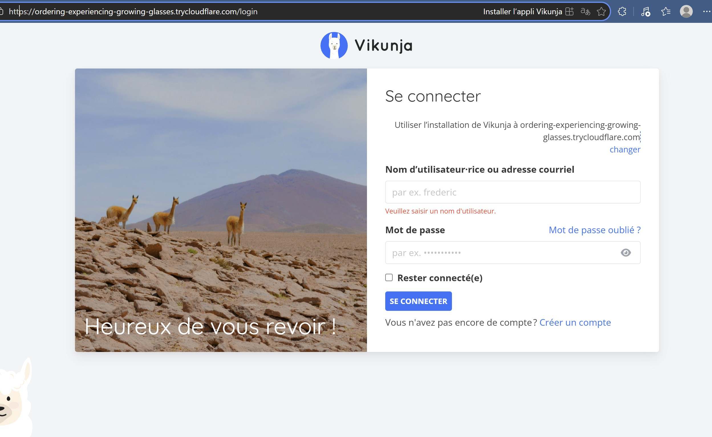

# Note_in_Nator

> **⚠️ MEMBRES DU GROUPE :**
> - **CHAOUKI Dina**
> - **TABBEB Bassim**
> - **PENAGOS Mathis**

---

## 1. Présentation du Projet
*Ce projet vise à déployer une instance auto-hébergée de Vikunja, une plateforme de gestion de tâches open-source. L'objectif est de fournir une solution collaborative, performante et privée pour gérer des projets, remplaçant des outils comme Trello ou Todoist. L'architecture sépare le frontend (interface utilisateur) du backend (API) pour une meilleure scalabilité..*
*Exemple : Ce projet est une stack permettant de gérer une liste de tâches (TodoList) avec une interface web et une base de données, le tout monitoré via Portainer.*

**Fonctionnalités principales :**
* Vues multiples : Gestion des tâches sous forme de Listes, Tableaux Kanban, Diagrammes de Gantt et Calendriers.

* Collaboration : Partage de listes, assignation de tâches et gestion des droits utilisateurs.

* Intégration : Synchronisation CalDAV pour les agendas externes.

**Lien accessible (si tunnel actif) :** [https://votre-url-random.trycloudflare.com](https://votre-url-random.trycloudflare.com)

**Screenshot de l'application déployée** : 
## 2. Architecture Technique

### Schéma d'infrastructure
*Ce schéma est généré dynamiquement à partir du fichier `architecture.puml` présent dans ce dépôt.*


*(Note aux étudiants : Pour que l'image ci-dessus s'affiche :*
1. *Créez un fichier `architecture.puml` à la racine de votre repo.*
2. *Mettez votre code PlantUML dedans.*
3. *Remplacez `VOTRE_USERNAME_GITHUB` et `NOM_DU_REPO` dans l'URL ci-dessus par les vôtres.*
4. *Assurez-vous que votre repo est Public.)*

### Description des services
| Service | Image Docker | Rôle | Port Interne |
| :--- | :--- | :--- | :--- |
| **Caddy** | `caddy:latest` | Reverse Proxy & Routing | 8000:80, 8443:443 |
| **Vikunja** | `vikunja/vikunja:latest` | Gestion de tâches | 3456 |
| **PostgreSQL** | `postgres:15-alpine` | Base de données | 5432 |
| **Adminer** | `adminer:latest` | Interface admin BDD | 8080 |
| **Cloudflared** | `cloudflare/cloudflared:latest` | Tunnel Cloudflare HTTPS | N/A |


## 3. Guide d'installation

Pour lancer le projet localement :

1.  Cloner le dépôt :
    ```bash
    git clone https://github.com/bassimtbb/Note_in_Nator.git
    cd Projet
    ```

2.  Créer le fichier `.env` :
    ```bash
    cp .env.example .env
    ```

3.  Lancer la stack :
    ```bash
    docker compose up -d
    ```

4.  Attendre que les services démarrent (30-45 secondes) :
    ```bash
    docker compose ps
    ```

5.  Accéder aux services :
    * **Vikunja** : http://localhost:8000/vikunja/
    * **Adminer** : http://localhost:8000/admin/
    * **Identifiants Adminer** :
      - Serveur: `database`
      - Utilisateur: `vikunja`
      - Mot de passe: `vikunja123`
      - Base: `vikunja`

## Vérification du déploiement

### Vérifier que tous les services tournent
```bash
docker compose ps
```

**Résultat attendu :** 5 conteneurs avec status "Up"
- caddy-proxy (8000:80, 8443:443)
- vikunja-app (3456)
- vikunja-database (5432)
- vikunja-adminer (8080)
- cloudflared-tunnel

### Vérifier les logs
```bash
# Logs Vikunja
docker compose logs vikunja -n 20

# Logs Caddy (routing)
docker compose logs caddy -n 20

# Logs Cloudflared (configuration info)
docker compose logs cloudflared -n 30
```

### Tester la connectivité
```bash
# Tester Vikunja via Caddy
curl http://localhost:8000/vikunja/

# Tester l'API
curl http://localhost:8000/api/v1/info

# Tester Adminer
curl http://localhost:8000/admin/
```

### Vérifier Cloudflare Tunnel
Pour vérifier que Cloudflare fonctionne :

1. **Le conteneur cloudflared doit rester actif** (sans crash)
   ```bash
   docker compose ps | grep cloudflared
   ```
   → Status doit être "Up"

2. **Les logs doivent afficher les instructions** (pas d'erreurs)
   ```bash
   docker compose logs cloudflared
   ```
   → Affiche le message d'aide (pas de "error" ou "ERR")

3. **Pour activer le vrai tunnel Cloudflare** :
   - Créer un tunnel: https://dash.cloudflare.com/
   - Récupérer les credentials
   - Placer dans `cloudflared_data/`
   - Redémarrer: `docker compose restart cloudflared`

## 4. Méthodologie & Transparence IA

### Organisation
*Expliquez rapidement comment vous avez travaillé (Pair programming, répartition des tâches...)*

### Utilisation de l'IA (Copilot, ChatGPT, Cursor...)

* **Outils utilisés :** ChatGPT 4, GitHub Gemini
* **Usage :**
    * *Génération de code :* ("Pour crée le fichier yaml")
    * *Débuggage :* (Ex: "ChatGPT nous a aidé à comprendre l'erreur 502 Bad Gateway")
    * *Documentation :* (Ex: "Nous avons reformulé la présentation de projet avec Gemini")
* **Apprentissage :** (Ce que l'IA a fait vs ce que vous avez compris).

## 5. Difficultés rencontrées & Solutions
* Problème 1 : Erreur CORS et Communications Inter-conteneurs.

Symptôme : Le navigateur bloquait les requêtes entre le frontend et l'API car ils tournaient sur des ports/services différents.

* *Solution avec Caddy :* Utilisation d'un Caddyfile pour centraliser les requêtes. Caddy agit comme point d'entrée unique. Il redirige les requêtes vers le frontend par défaut, et vers l'API si l'URL commence par /api ou /dav. Cela élimine les problèmes de CORS puisque pour le navigateur, tout provient du même domaine.
